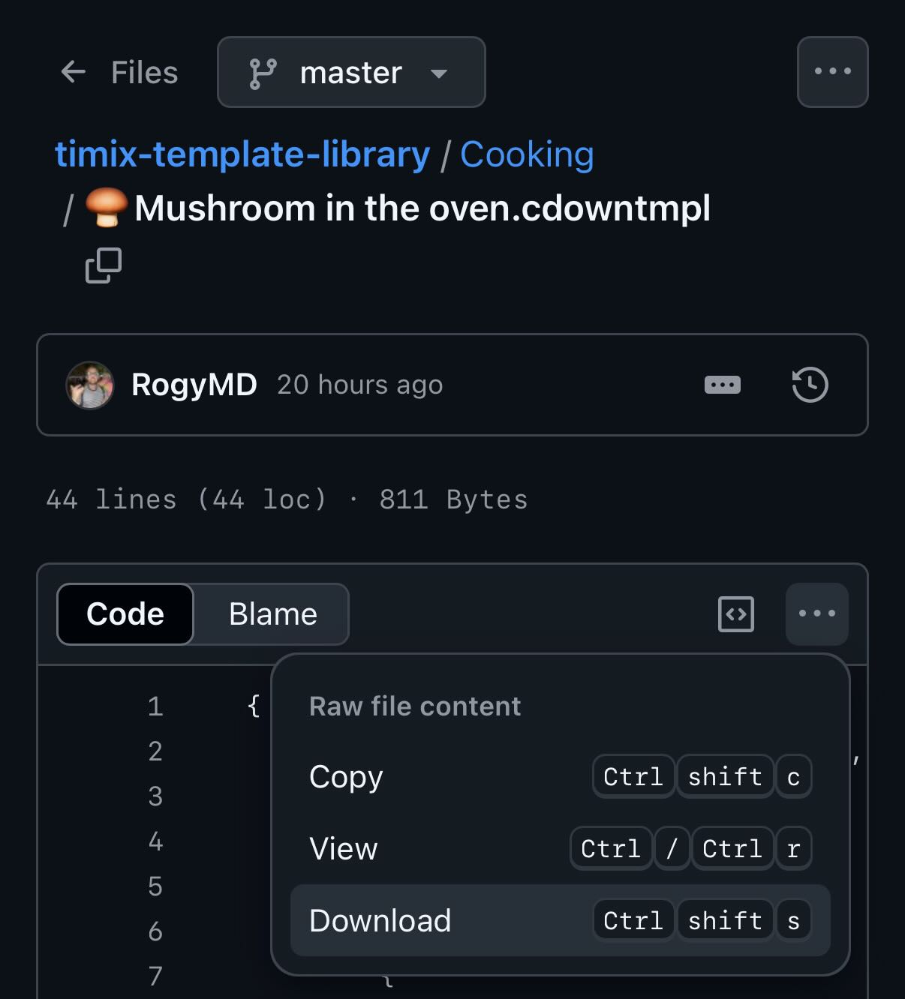

# Timix Template Library

**A library of Timix templates to help you focus, move, cook, rest, and play.**

Timix templates are ready-made sessions designed for everything from studying and workouts to cooking and board games.  
Use them as they are, customize them, or create your own to fit your life and rhythm.
If you can't find a template that suits your needs, you can easily create your own templates with help of [TimixGPT](https://rogy.app/timixgpt).

[Learn more about Timix here.](https://rogy.app/timix)

---

## Categories

- 🎲 [Board Games](Board%20Games/README.md)
- 👨🏽‍🍳 [Cooking](Cooking/README.md)
- 🧑🏽‍🎨 [Creativity](Creativity/README.md)
- 🧠 [Focus](Focus/README.md)
- 🏡 [Home](Home/README.md)
- 💆🏽‍♀️ [Wellness](Wellness/README.md)
- 💪🏽 [Workout](Workout/README.md)

---

## How to Use

1. Browse the category folders.
2. Find a timer that fits your needs.
3. Download the `.cdowntmpl` file.  
   
4. Open Timix and import it.

> 💡 If you're downloading on iPhone or iPad, we recommend using [Brave Browser](https://apps.apple.com/app/brave-browser-search-engine/id1052879175) (or another browser) instead of Safari. Safari may add a `.txt` extension to `.cdowntmpl` files.

That's it — you're ready to go.

---

## How to Contribute

We welcome contributions from everyone.  
To add your template independently:

1. Fork this repository.
2. Add your `.cdowntmpl` file to the right category folder.
3. Follow the file naming convention: clear title with an emoji (e.g., `🍕Pomodoro Focus.cdowntmpl`).
4. Update the appropriate folder's README by listing your template with a short description and direct link.
5. Open a Pull Request.

Or simply email me your template at [timix@rogy.app](timix@rogy.app) and I'll add it for you.

Thank you for helping expand the library!

---

## License

This project is licensed under [The Unlicense](LICENSE).  
Templates are released into the public domain — free for any use.

---

## Thanks

This library is made by the Timix community.  
Thanks for sharing your rhythms with the world.
